# CSCE 435 Group project

## 1. Group members:
1. Jessica Williams
2. Stephanie Lam
3. Steve Wang
4. Paola Gallegos Tamez

---

## 2. Project topic
Parallelized Sorting Algorithms

## 2a. Project topic
Sorting algorithms
We will compare each of the four algorithms (Bucket Sort, QuickSort, Sample Sort, Bubble Sort) by implementing in MPI as well as Cuda. We plan to use reverse sorted, random, and 10% noisy data and compare each of the implementations across those as well.

## 2b. Pseudocode for each parallel algorithm

### Bucket Sort
```
function bucketsort(data,n_buckets)
	create n_buckets empty arrays
	loop over data:
		add data[i] to correct bucket

	for each bucket:
		bitonicsort(bucket)


	for each bucket:
		copy bucket contents to answer array
```

### QuickSort
create function that takes in an array, two integers, low and high
```
	function
		set integer as pivot, equal to element at position high in array
		set integer as k, equal to low - 1
		for each element from low to high
			if element at array is less than pivot
				k increases
				swap the numbers at position element and k
			
		end for
		swap element at k+1 and element at high
		return k+1
```

create second function takes in array , two integers, low and high
```
	in function
		if low is less than high
			set integer as p, call first function with values given
			recursive call with array, low and p-1
			recursive call with array, p+1, and high
		end if
```

in main function call second function with array, 0 and n-1, n being the size of the array.

### Bubble Sort
create function that takes in an array of items
```
function bubbleSort(list: array of items)
	loop = list.count
	for i = 0 to loop-1
		boolean swapped = false
		for j = 0 to loop-1
			if list at index j > list at index j+1
				swap(list at index j, list at index j+1)
				swapped = true
			if (not swapped)
				break
	return list
```

### Sample Sort
With unsorted array of size n
Create m buckets (m likely # of threads)
```
for element in array
    bucket index = element index / m
    add element to bucket[ bucket index]

for each bucket in buckets
    sort bucket with quicksort

need m-1 pivot elements

piv_num = m-1
```
create sample_selection array
```
for each bucket in buckets
    mod_number = ceil(number of elements in bucket /(piv_num+1))
    for i in range of 1 and piv_num
        append bucket[imod_number] element to sample_selection


Global splitters = []

sort sample_selection

mod_number= ceil (number of elements in sample_selection/ (piv_num +1))
for i in range of 1 and piv_num
    append sample_selection[ i mod_number] to global splitters
```
we should have m-1 global splitters, now use these splitters for bucket sort
perform bucket sort given m buckets and the bucket partitions being the global splitters

## 2c. Evaluation Plan - what and how will you measure and compare
For MPI:
Processes: 2, 4, 8, 16, 32, 64, 128, 256, 512, 1024
Input Size: 2^16, 2^18, 2^20, 2^22, 2^24, 2^26, 2^28

For CUDA:
Threads: 64, 128, 256, 512, 1024
Input Size: 2^16, 2^18, 2^20, 2^22, 2^24, 2^26, 2^28

We will be measuring strong scaling, weak scaling, and speedups of our algorithms and also compare how each of the datatypes (random, sorted, reverse sorted, and 1% perturbed) compare against each other.

---

## 3. Project implementation

Pseudocode of our algorithms. We used Caliper Marks to time each section of our code and analyzed the resulting Caliper files. All implementations have at least the following marks: main, data_init, comp, comm, and correctness_check

### Bucket Sort
Required Code Regions: data_init, comm, comp, comm_large, comp_large, comm_small
comp_small, correctness_check

CUDA Implementation (Pseudocode):
```
function bucketsort(data,sizes,n_buckets)
        compute thread index
        add data of index to correct bucket
    increment bucket size
    
function main()
    generateData(data) //on host
    
    copy data to device
    bucketSort(data,sizes,n_buckets) //on kernel
    for each bucket:
            bitonicsort(bucket) //on kernel
    for each bucket:
            copy bucket contents to answer array on host
```

MPI Implementation (Pseudocode):
```
function main()
    generateData(data)
    
    loop over local data
        add data to correct bucket
        increment bucket size
    
    add then broadcast bucket sizes
    
    sort local bucket
    
    gather all buckets together
```

### Quicksort

CUDA Implementation (Pseudocode):
```
int THREADS;
int BLOCKS;
int NUM_VALS;

const char* bitonic_sort_step_region = "bitonic_sort_step";
const char* cudaMemcpy_host_to_device = "cudaMemcpy_host_to_device";
const char* cudaMemcpy_device_to_host = "cudaMemcpy_device_to_host";

function float random_float() {
  return (float)rand() / (float)RAND_MAX;
}

function void array_fill(float* arr, int length) {
  srand(time(NULL));
  for i = 0 to length - 1 do
    arr[i] = random_float();
  end for
}

function void quick_sort_step(float* dev_values, int l, int h) {
  Launch a CUDA kernel to perform a step of the quicksort on dev_values within the range [l, h].
  // This part contains GPU-specific CUDA code.
}

function void quick_sort(float* values, int low, int high) {
  Allocate GPU memory for dev_values.
  Copy values from the CPU to the GPU (dev_values).
  Perform the quicksort step on dev_values using CUDA.
  Copy the sorted values back from the GPU to the CPU (values).
  Free the GPU memory.
}

function int main(int argc, char* argv[]) {
  Parse command line arguments to set THREADS and NUM_VALS.
  Calculate BLOCKS based on NUM_VALS and THREADS.

  Initialize the Caliper configuration manager.

  Allocate memory for an array of float values.

  Record the start time.

  Perform the quicksort on the array of values.

  Record the stop time.

  Flush the Caliper configuration manager to capture profiling information.
}
```

### Bubble Sort
Required Code Regions: data_init, comm, comp, comm_large, comp_large, comm_small
comp_small, correctness_check

Cuda Implementation (Psuedocode):
```
// Function to generate a random float
function random_float() -> float
    return random float value between 0 and 1

// Function to fill an array with random float values
function array_fill(arr: float[], length: int)
    for i from 0 to length - 1
        arr[i] = random_float()

// Function to verify the correctness of the sorted array
function verify(values: float[]) -> int
    for i from 0 to length of values - 2
        if values[i] > values[i+1]
            return -1
    return 1

// CUDA kernel for a single step of bubble sort
function bubble_sort_step(dev_values: float[])
    i = threadIdx.x + blockDim.x * blockIdx.x
    next = i + 1
    if next < d_NUM_VALS
        if dev_values[i] > dev_values[next]
            swap dev_values[i] and dev_values[next]

// Function to perform bubble sort on the GPU
function bubble_sort(values: float[])
    allocate device memory for dev_values
    copy values from host to dev_values
    set d_NUM_VALS to NUM_VALS
    define grid and block dimensions
    for i from 0 to NUM_VALS - 2
        call bubble_sort_step kernel with dev_values as argument
    synchronize GPU
    copy dev_values from device to host
    free device memory

// Main function
function main(argc: int, argv: string[]) -> int
    THREADS = convert argv[1] to int
    NUM_VALS = convert argv[2] to int
    BLOCKS = NUM_VALS / THREADS
    start = current time
    allocate memory for values
    call array_fill with values and NUM_VALS as arguments
    call bubble_sort with values as argument
    stop = current time
    size = NUM_VALS * size of float
    data_size_gb = kernel_call * size * 4 * (1e-9) // Size in GB
    kernel_execution_time_s = (stop - start) / CLOCKS_PER_SEC // Kernel execution time in seconds
    effective_bandwidth_gb_s = data_size_gb / kernel_execution_time_s
    if verify(values)
        print "Sort successful"
    else
        print "Sort unsuccessful"
    free memory for values
    return 0

```

MPI Implementation (Pseudocode):

```
function partnerFind(int phase, int rank)
    if phase % 2 == 0
        if rank % 2 == 0
            partner = rank + 1
        else
            partner = rank - 1
        end if
    else
        if rank % 2 == 0
            partner = rank - 1
        else
            partner = rank + 1
        end if
    end if
    return partner
end function

function verify(data: array of double, dataSize: int) -> int
    for i from 0 to dataSize - 2
        if data[i] > data[i+1]
            return -1
        end if
    end for
    return 1
end function

function main(argc: int, argv: array of string) -> int
    my_rank = get_MPI_Comm_rank(MPI_COMM_WORLD)
    numprocs = get_MPI_Comm_size(MPI_COMM_WORLD)

    IF numprocs < 2 THEN
        MPI_Abort(MPI_COMM_WORLD, -1)
    END IF

    mode = 0
    dataSize = 100

    dataSize = convert_to_integer(argv[1])
    mode = convert_to_integer(argv[2])

    local_data = dataSize / numprocs
    test = new array of size local_data
    final_arr = null

    genData(dataSize, mode, test)

    Initialize arrays temp and data

    FOR i = 0 TO numprocs
        partner = partnerFind(i, my_rank)

        IF partner >= numprocs OR partner < 0 THEN
            CONTINUE
        END IF

        IF my_rank % 2 == 0 THEN
            MPI_Send(test, local_data, MPI_DOUBLE, partner, 0, MPI_COMM_WORLD)
            MPI_Recv(temp, local_data, MPI_DOUBLE, partner, 0, MPI_COMM_WORLD, MPI_STATUS_IGNORE)
        ELSE
            MPI_Recv(temp, local_data, MPI_DOUBLE, partner, 0, MPI_COMM_WORLD, MPI_STATUS_IGNORE)
            MPI_Send(test, local_data, MPI_DOUBLE, partner, 0, MPI_COMM_WORLD)
        END IF

        Merge test and temp arrays into data array
        Sort data array

        half_data = data + local_data

        IF my_rank < partner THEN
            Copy data to test
        ELSE
            Copy half_data to test
        END IF
    END FOR

    IF my_rank == MASTER THEN
        final_arr = new array of size dataSize
    END IF

    MPI_Gather(test, local_data, MPI_DOUBLE, final_arr, local_data, MPI_DOUBLE, 0, MPI_COMM_WORLD)

    IF my_rank == MASTER THEN
        IF verify(final_arr, dataSize) == 1 THEN
            PRINT "Sort successful"
        ELSE
            PRINT "Sort unsuccessful"
        END IF
    END IF

    return 0
end function
```

### Sample Sort
Required Code Regions: data_init, comm, comp, comm_large, comp_large, comm_small
comp_small, correctness_check

MPI Implementation:

For sample sort, the first MPI gather gathers all the splitters from the processors and combines them. Then, MPI all to all will send data from all processes to the communicators, the buckets are sorted locally, and then eventually are gathered together to form a sorted array

CUDA Implementation:

In the cuda kernel, the computation for sorting each block/bucket is performed. After each bucket is sorted, we obtain the splitters from them with a cuda memcpy, and then each kernel places elements into their respective buckets. Another memcpy is used to copy the sorted values from the GPU to the main process into one array.

## 3b. Collect Metadata
We collect the following metadata in our implementations:
Launch date of the job, libraries used, command line used to launch the job, name of the cluster, name of the algorithm, what the programming model is (MPI or CUDA), the datatype of input elements, size of the datatype, number of elements in the input dataset, what the input type is, number of processesors for MPI, number of threads for CUDA, number of blocks for CUDA, our group number, and where we got our source code from.

---

## 4. Performance evaluation
MPI Comparison between Algorithms:\
\
For MPI, bucket sort is clearly the best implementation, even though communication time starts to become a limiting factor as the number of threads increases. This plot was done at 1048576 because that was the size that worked best across implementations. Sample sort was very inefficient and bubble sort was near constant.\

CUDA Comparison between Algorithms:\
\
For CUDA, bucket sort is still the best implementation by absolute terms. However, the odd-even version of bubble sort is more stable to thread sizes and would likely perform better across a variety of problems. This plot was also done at 1048576 because that was the size that worked best acroos implementations.\

### Bucket Sort:
#### MPI Comparisons:
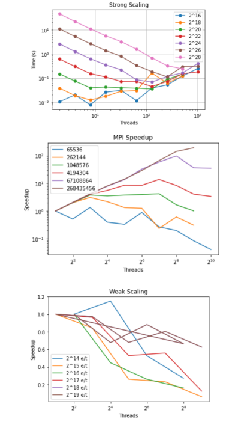\
MPI scales very well with bucket sort. As thread count increases, the communication time increases because not only the data but also the bucket sizes and offsets must be communicated between processes, and this is a lot of overhead multiple times. We do see speedup of up to 100x for the largest input sizes which is good performance. The speedup is not quite enough to support weak scaling across the main of the program, but weak scaling is better for larger input sizes.\
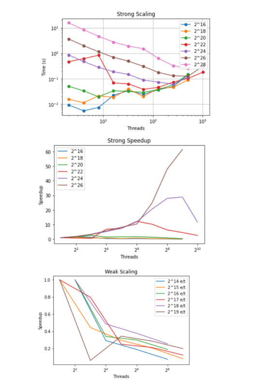\
With sorted data, the algorithm works better than random with smaller input sizes, likely because it distributes more uniformly into buckets and is not subject to random fluctuation. This makes the speedup worse, especially for the small input sizes as it is faster at the baseline.\
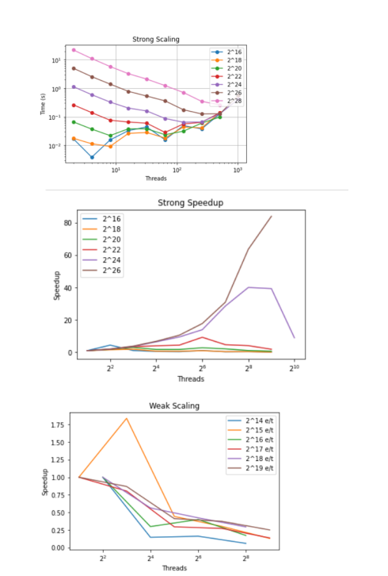\
Reverse sorting follows a very similar trend to sorted data. Since everything is sorted into buckets and then combined, this type of symmetry is to be somewhat expected.\
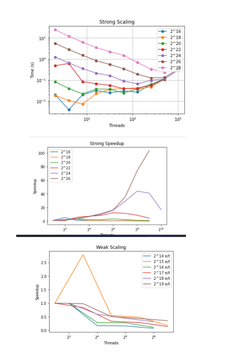\
Adding 1% randomness does not change the overall performance that much from the fully sorted implementation. The bucket sizes are still very close to evenly distributed.\

#### CUDA Comparisons:
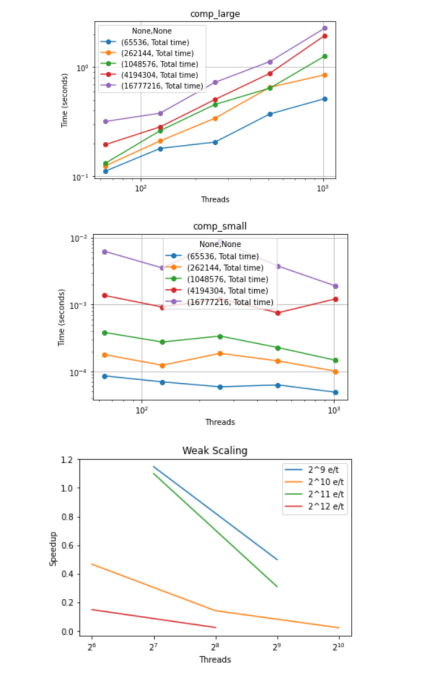\
CUDA exhibits exceptionally poor performance. This is random input. The comp_small region represents sorting the data into buckets, where the number of buckets is equal to the number of threads. This has a moderate parallelization, and is hindered by the necessity of using atomics to increment the counts of the numbers in each bucket. The comp_large region represents the region of sorting all the buckets. I tried bitonic as well as thrust::sort, and both of them had qualitiatively similar results. The challenge is that although the sorting of one bucket is parallellized, each bucket must be sorted. So more threads means more buckets means more sorting, which is why comp_large increases with threads.\
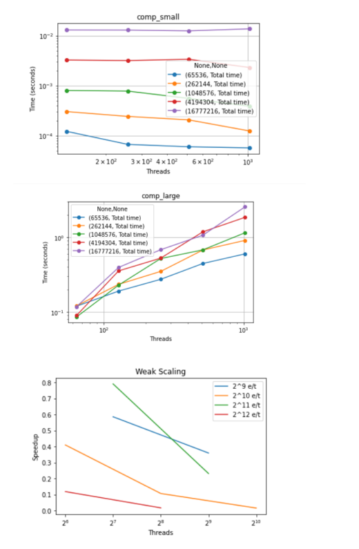\
With sorted input, we see less parallelization in the sorting data into buckets region. This is because the data is sorted so each thread in a block will be adding to the same bucket, resulting in longer waiting times for the atomic incrementing of the counts of the numbers in each bucket.\
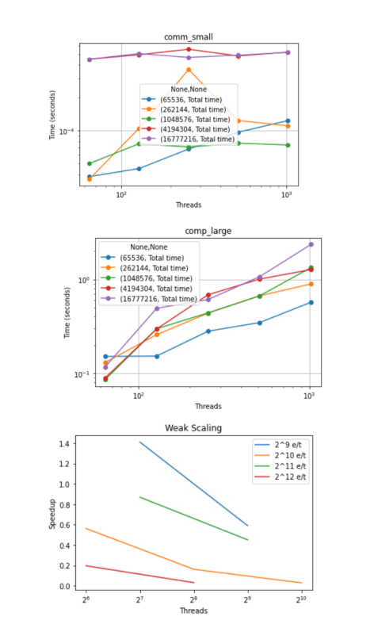\
Reverse sorted input shows a similar trend to sorted input, again as bucket sort is fairly symmetric.\
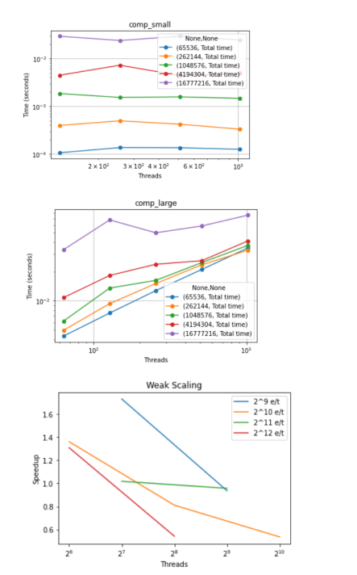\
Perturbing the data by 1% does not significantly change performance, but does make it fluctuate a little.\

### Bubble Sort:
#### MPI Comparison between Input Types:
##### Strong Scaling:
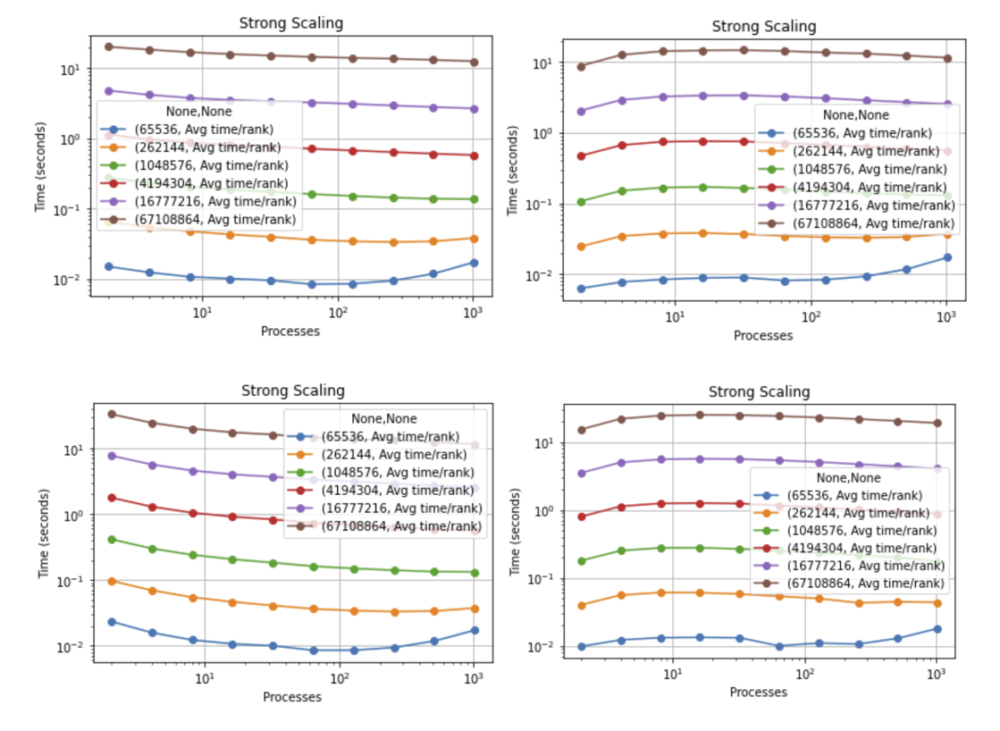\
Top left: Random  Top Right: Sorted  Bottom Left: Reverse Sorted  Bottom Right: 1% Perturbed\
From the 4 graphs, we can see that the random input type and 1% input type had the best strong scaling for the computation time. This is because of the fact that the bubble sort parallel implementation had to use an odd even transposition to make it parallelized. Odd even transposition works for higher input sizes which you can see that the time decreases as the input size increases. Additionally, due to the nature of odd even transposition, having a random input and 1% perturbed input is more efficient than a sorted or reverse sorted input.\
##### Weak Scaling:
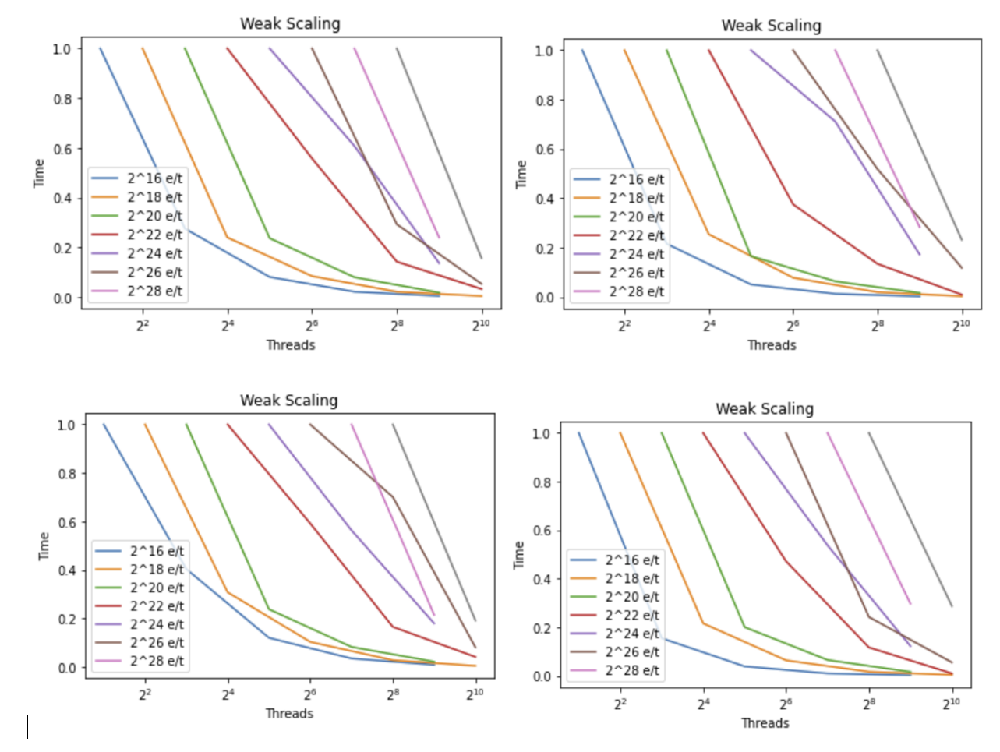\
Top left: Random  Top Right: Sorted  Bottom Left: Reverse Sorted  Bottom Right: 1% Perturbed\
From the 4 graphs, we can see that the main implementation of bubble sort scales weakly throughout all 4 input types. This is due to the fact that bubble sort itself is an extremely inefficient algorithm even with the help of an odd even transposition. This can also imply that the communication time was inefficient as well. Although the bubble sort implementation for MPI was parallelized, it was not parallelized well hence the weak scaling.\
##### Speedup:
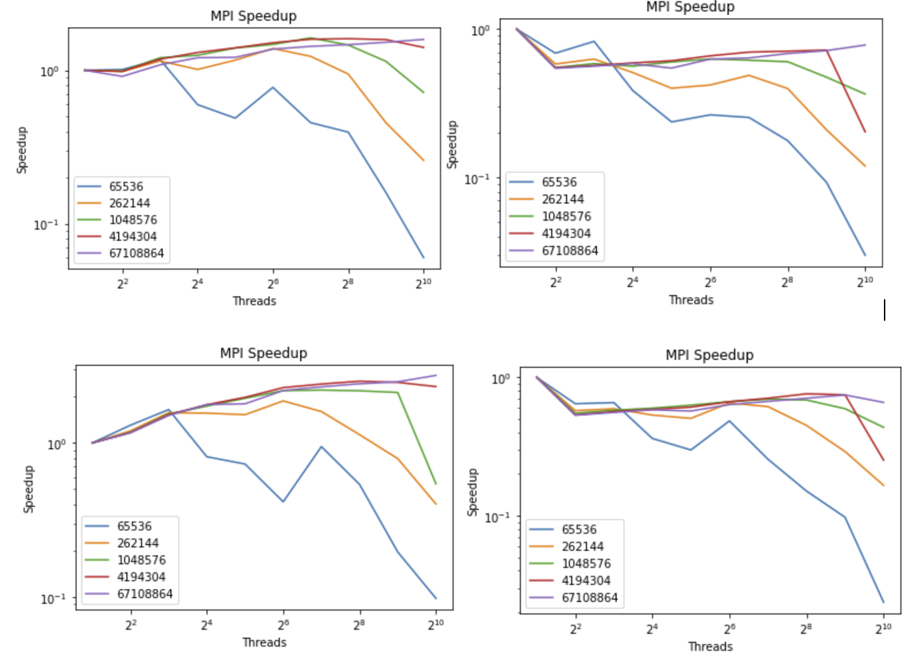\
Top left: Random  Top Right: Sorted  Bottom Left: Reverse Sorted  Bottom Right: 1% Perturbed\
As seen from the 4 graphs, the speedup for each of the input type was not good, but out of the 4 data input types, the best speedup was the random input type. This is attributed to the fact that the odd even transposition works best with a random data than sorted or reverse sorted. However, since the implementation is still a bubble sort algorithm, the efficiency of the sorting gets worse if the data size is small.\

Based on the analysis, the random input data performed the best which was expected given the behavior of odd even transposition, but due to the inherent inefficiency of bubble sort, it did not matter what kind of data type was used or what the data size was, leading it to still be pretty inefficient.\

#### CUDA Comparison between Input Types:
##### Strong Scaling:
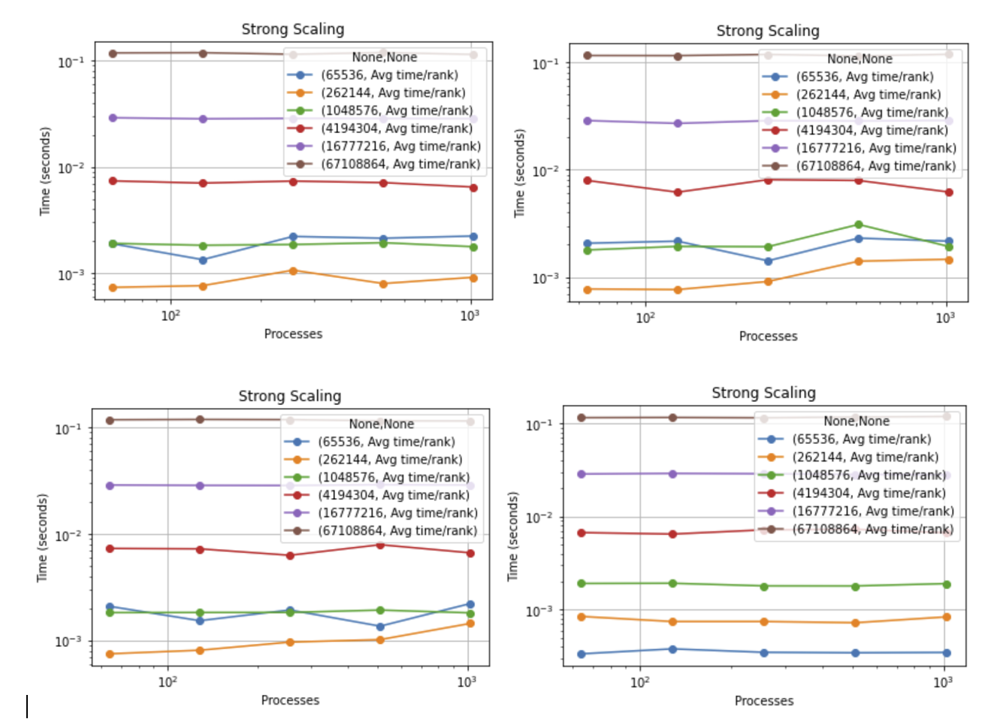\
Top left: Random  Top Right: Sorted  Bottom Left: Reverse Sorted  Bottom Right: 1% Perturbed
The CUDA implementation was not done well and in turn, it was parallelized very very inefficiently with extremely poor performance. As we can see from the 4 graphs, there is almost no strong scaling visible in the communication time for any of the data input types. I tried using the odd even transposition for the CUDA implementation as well and it was not parallelized well hence the extremely flat lines.

##### Weak Scaling:
\
Top left: Random  Top Right: Sorted  Bottom Left: Reverse Sorted  Bottom Right: 1% Perturbed
As stated above, since the CUDA implementation was not parallelized well, there is a very weak scaling, but is almost not noticeable. There is almost no difference between the 4 data input types since they all perform poorly.

##### Speedup:
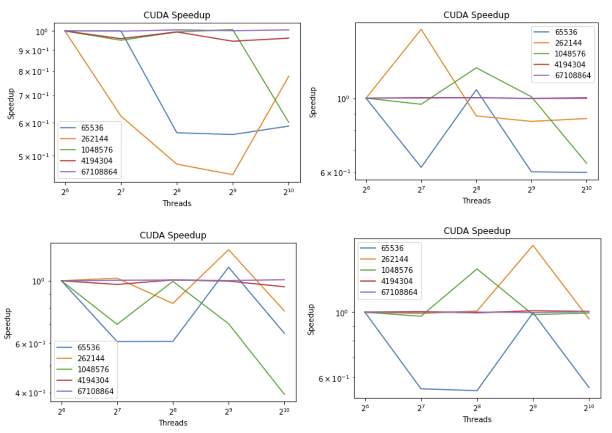\
Top left: Random  Top Right: Sorted  Bottom Left: Reverse Sorted  Bottom Right: 1% Perturbed
Since the CUDA implementation was not parallelized well, the speedups between the 4 graphs are all over the place. The one that did the best between the 4 input data types would be sorted and reverse sorted surprisingly given that odd even transposition performs poorly when the data is already sorted or reverse sorted.

## 5. Team communication
Our team will mainly be using discord as our means of communication due to the fact that it is easy to use and if we ever need to voice call or meet up remotely, we do not have to set up a zoom meeting.
